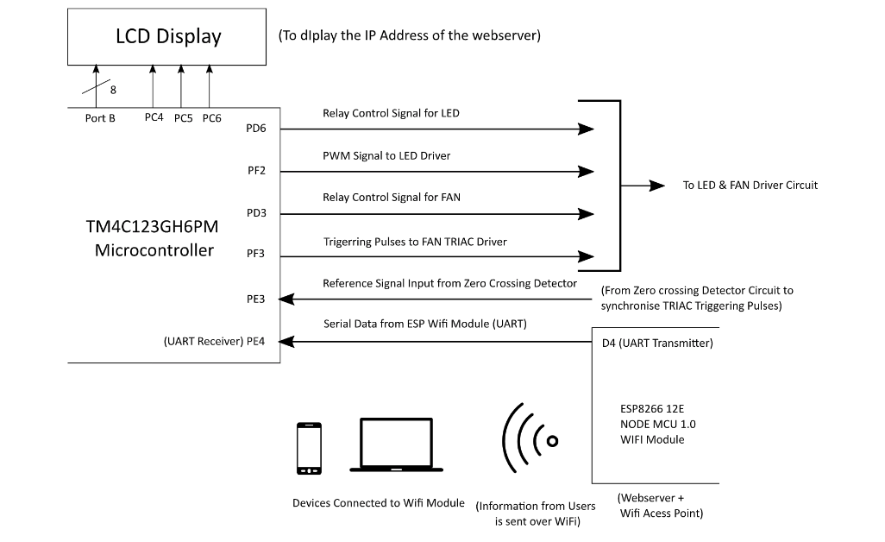

# Home-Equipment-Profiling  
An embeded system with a user friendly GUI, web page hosted over server.  
Optimize the intensity of a LED light fixature with logarithmic variation of light.  
Controlling the speed of fan for a particular work station.  
 

Goto [Report](https://github.com/sourabh-suri/Home-Equipment-Profiling/blob/master/Report/ESD_Report.pdf) for further details.....

## Development  
Want to contribute? **:pencil:**  
  
To fix a bug or enhance an existing module, follow these steps:  
  
1. Fork the repo
2. Create a new branch (`git checkout -b exciting-stuff`)
3. Make the appropriate changes in the files
4. Add changes to reflect the changes made
5. Commit your changes (`git commit -am 'exciting-stuff!!'`)
6. Push to the branch (`git push origin exciting-stuff`)
7. Create a Pull Request
  
  
## Interested?  
If you find a bug (the app couldn't handle the query and / or gave irrelevant results), kindly open an issue [here](https://github.com/sourabh-suri/Home-Equipment-Profiling/issues/new) by including your search query and the expected result.  
  
If you'd like to request a new functionality, feel free to do so by opening an issue [here](https://github.com/sourabh-suri/Home-Equipment-Profiling/issues/new) including some sample queries and their corresponding results.
